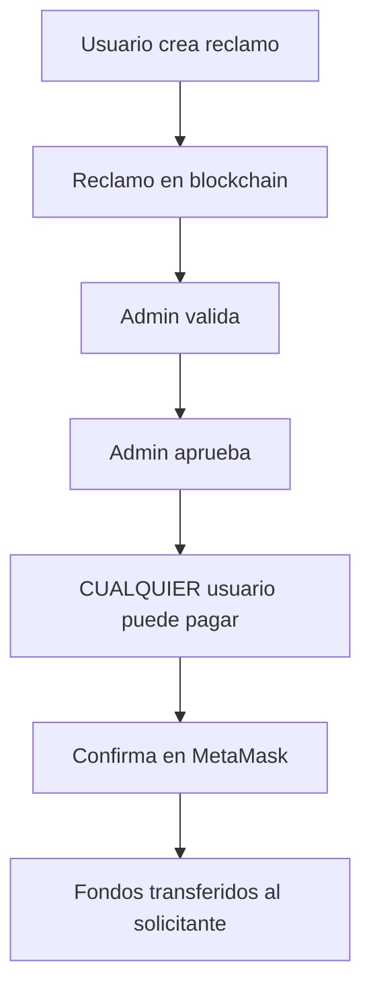

# 🎯 Reclamo de Prueba - Sistema de Pagos Público

## ✅ Nuevo Contrato Desplegado

**Dirección del contrato:** `0xdD89f538b34B9Bf62d4413Ee8FFa6F94C893497A`  
**Red:** Sepolia Testnet  
**Características:** ✅ **Cualquier wallet puede pagar** (no requiere ser administrador)

---

## ✅ Reclamo de Prueba Creado

**ID:** `2873275184`  
**Solicitante:** `0x914582B7f5eDCC4eE3950db39519Cb29265b4CAD`  
**Descripción:** Reclamo de prueba - Daños en vehículo  
**Monto:** `0.001 ETH`  
**Estado:** Creado (en blockchain)  
**Hash TX:** [Ver en Etherscan](https://sepolia.etherscan.io/tx/0x87c694be1c1c72effdb34c47630f994ef37f04bc9a89df20a63f9c592ae707e9)

---

## 📝 Paso 1: Sincronizar a MongoDB

Abre la consola del navegador en tu aplicación (`http://localhost:3000`) y ejecuta:

```javascript
// Sincronizar reclamo a MongoDB
fetch("/api/reclamos/sync", {
    method: "POST",
    headers: { "Content-Type": "application/json" },
    body: JSON.stringify({
        siniestroId: 2873275184,
        solicitante: "0x914582B7f5eDCC4eE3950db39519Cb29265b4CAD",
        descripcion: "Reclamo de prueba - Daños en vehículo",
        monto: 0.001,
        tipoSiniestro: "Daños materiales - Prueba de sistema de pagos público",
        numeroPoliza: "POL-TEST-2873275184",
        documentos: [],
        ubicacion: "Test Location",
    }),
})
    .then((res) => res.json())
    .then((data) => {
        console.log("✅ Resultado:", data);
        if (data.success) {
            alert("✅ Reclamo sincronizado! ID: 2873275184");
            console.log("🎯 Ve a /admin para validar y aprobar");
        }
    });
```

---

## 📝 Paso 2: Validar y Aprobar (Admin)

1. Ve a `http://localhost:3000/admin`
2. Busca el reclamo **ID: 2873275184**
3. Haz clic en **"Validar"** (solo admin: `0x914582B7f5eDCC4eE3950db39519Cb29265b4CAD`)
4. Haz clic en **"Aprobar"** con notas: "Aprobado para prueba de pagos públicos"

---

## 📝 Paso 3: Pagar con CUALQUIER Wallet 🎉

**IMPORTANTE:** Ahora **cualquier wallet** puede pagar, no solo administradores.

### Opción A: Desde el panel de admin

1. Haz clic en **"Procesar Pago"**
2. Selecciona **"Pagar con MetaMask"**
3. Confirma con tu wallet personal: `0x84B402a8AA34fAa78a1EbfdeBCAa803F4f9C6a47`
4. Monto: `0.001 ETH` + gas fees

### Opción B: Desde la consola (simulando usuario final)

```javascript
// Conectar MetaMask
const provider = new ethers.BrowserProvider(window.ethereum);
await provider.send("eth_requestAccounts", []);
const signer = await provider.getSigner();

// Contrato
const contractAddress = "0xdD89f538b34B9Bf62d4413Ee8FFa6F94C893497A";
const abi = [
    "function pagarReclamoPublico(uint256 _siniestroId) external payable",
];
const contract = new ethers.Contract(contractAddress, abi, signer);

// Pagar
const tx = await contract.pagarReclamoPublico(2873275184, {
    value: ethers.parseEther("0.001"),
});

console.log("⏳ Transacción enviada:", tx.hash);
const receipt = await tx.wait();
console.log("✅ Pago confirmado!", receipt);
```

---

## 🔄 Cambios Implementados

### ✅ Contrato Actualizado (`ReclamacionesSeguros.sol`)

```solidity
// Nueva función - Cualquier persona puede pagar
function pagarReclamoPublico(uint256 _siniestroId) external payable {
    // ✅ No requiere ser administrador
    // ✅ Solo verifica que el reclamo esté aprobado
    // ✅ Transfiere al solicitante automáticamente
}

// Función anterior - Solo administradores
function procesarPago(uint256 _siniestroId) external payable {
    // ⚠️ Requiere modificador soloAdministrador
}
```

### ✅ Frontend Actualizado (`payment-modal.tsx`)

-   ❌ **ELIMINADO:** Verificación de permisos de administrador
-   ✅ **AGREGADO:** Uso de función `pagarReclamoPublico()`
-   ✅ **MEJORADO:** Mensajes más claros para usuarios finales

---

## 🎯 Flujo Completo de Usuario Final



---

## ✨ Ventajas del Sistema Público

1. ✅ **Flexibilidad:** Aseguradoras, intermediarios, o el mismo solicitante pueden pagar
2. ✅ **Descentralización:** No depende de una sola cuenta administradora
3. ✅ **Transparencia:** Cualquiera puede verificar y ejecutar el pago
4. ✅ **Escalabilidad:** Múltiples pagadores pueden procesar diferentes reclamos simultáneamente

---

## 📊 Verificar Estado

### Verificar en blockchain:

```bash
npx hardhat run scripts/verify-reclamo.js --network sepolia
# Ingresa: 2873275184
```

### Verificar en MongoDB:

```javascript
fetch("/api/reclamos")
    .then((res) => res.json())
    .then((data) => {
        const reclamo = data.data.find((r) => r.siniestroId === 2873275184);
        console.log("Reclamo:", reclamo);
    });
```

---

## 🚨 Importante

-   ✅ **Contrato anterior:** `0xC32fD5E99ED8180aA3Bf799C4f37cbD88ce2dA8C` (requería admin)
-   ✅ **Contrato nuevo:** `0xdD89f538b34B9Bf62d4413Ee8FFa6F94C893497A` (público)
-   ⚠️ Los reclamos del contrato anterior NO funcionarán con el nuevo sistema
-   ⚠️ Debes usar el nuevo reclamo: **2873275184**

---

## 🎉 ¡Listo para Probar!

Una vez sincronizado y aprobado el reclamo, podrás probarlo con tu wallet personal `0x84B402a8AA34fAa78a1EbfdeBCAa803F4f9C6a47` sin necesidad de ser administrador. 🚀
